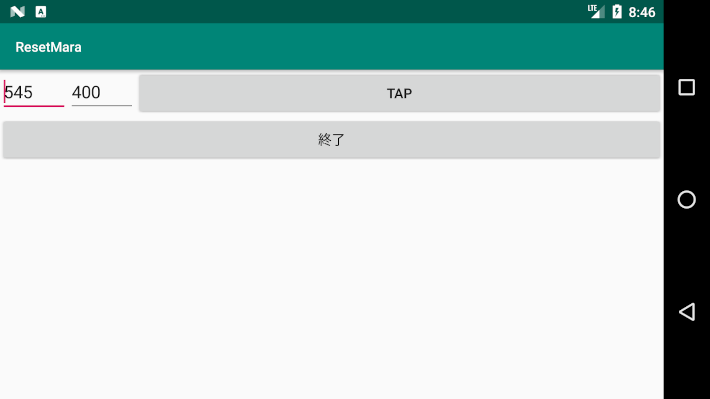

# ResetMara

## Use
> ./adb shell

> sh -c "CLASSPATH=/data/app/com.example.resetmara-1/base.apk /system/bin/app_process /system/bin com.example.resetmara.InputHost"
## DebugApk
[app-debug.apk](https://github.com/noitaro/ResetMara/raw/master/build/outputs/apk/debug/app-debug.apk)
## WebSite
https://noitalog.tokyo/android-device-touch-event/
